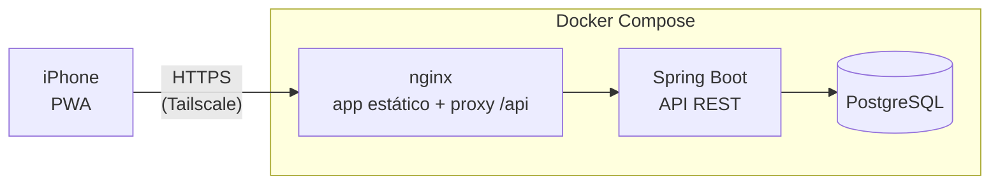

<div align="center">

# Bicavi

**O orçamento do mês da casa, no bolso.**

Receitas, contas, compras no cartão e parcelas, com o saldo do mês sempre à vista.
Um PWA feito para o iPhone, com backend em Java e Spring Boot.

[](https://github.com/devluiscavalcante/bicavi-finance/actions/workflows/ci.yml)


<br>


&nbsp;&nbsp;

&nbsp;&nbsp;


<sub>Tela do mês (claro e escuro) e um passeio pelo app. Os dados são fictícios.
Também em <a href="docs/images/demo.mp4">vídeo (MP4)</a>.</sub>

</div>

---

## Sobre

Todo mês, o casal anotava no papel as contas a pagar, somava os dois salários e via
quanto sobrava. O Bicavi faz isso de um jeito mais organizado: cada um lança pelo
celular, os totais aparecem na hora e dá para **planejar os meses seguintes**
(salários e parcelas do cartão lançados com antecedência).

O projeto também é um laboratório de estudo de backend Java: cada decisão de
arquitetura está explicada no código e neste README.

## Funcionalidades

- **Mês na palma da mão:** saldo, receitas e despesas, gastos por categoria e lista do mês agrupada por dia.
- **Lançamento rápido:** painel que sobe por baixo, com valor, forma de pagamento (Pix, dinheiro, débito, crédito, boleto), categoria, descrição e data.
- **Cartões de crédito e faturas:** a compra no crédito fica ligada a um cartão. As faturas do mês aparecem agrupadas, e tocar numa fatura filtra a lista para conferir com o banco.
- **Compras parceladas:** de 2x a 24x, com os centavos que sobram na 1ª parcela. Editar ou excluir vale só para a parcela escolhida ou para ela e as seguintes.
- **Planejamento e histórico:** os meses futuros são livres para lançar. O mês anterior fica editável até o dia 5, e os mais antigos ficam somente leitura.
- **Categorias e cartões:** categorias de despesa padrão criadas no cadastro, mais as suas, sem nomes repetidos (maiúsculas e minúsculas contam como iguais).
- **Cara de app:** instala na tela de início do iPhone, tem tema claro e escuro automático, troca de mês arrastando o dedo e se atualiza sozinho.

## Stack

| Camada | Tecnologias |
|---|---|
| **Backend** | Java 21, Spring Boot 4.1 (Web MVC, Data JPA, Validation, Security, OAuth2 Resource Server), Flyway, Bucket4j |
| **Banco** | PostgreSQL 17 |
| **Frontend** | React 19, TypeScript, Vite, React Router, vite-plugin-pwa |
| **Testes** | JUnit Jupiter, Mockito, MockMvc, Testcontainers (Postgres real), Vitest |
| **Infra** | Docker (builds multi-stage), Docker Compose, nginx, Tailscale, GitHub Actions |

## Arquitetura



- **Mesma origem:** o nginx serve o app e repassa `/api` para o backend, então não há CORS. Em desenvolvimento, o proxy do Vite faz o mesmo papel.
- **Pacotes por funcionalidade:** cada pasta tem controller, service, repository e DTOs de um assunto: `auth`, `transaction`, `category`, `card`, `report`, `period`, `security`.

```
backend/src/main/java/com/bicavi/
├── auth/          cadastro, login, limite de tentativas
├── transaction/   transações, parcelas, regras de negócio
├── category/      categorias (+ padrões do cadastro)
├── card/          cartões de crédito
├── report/        resumo mensal (totais, por categoria, por fatura)
├── period/        quais meses podem ser editados
├── security/      JWT, usuário atual
└── common/        exceções e tratamento de erros (ProblemDetail)
```

## Decisões técnicas

| Tema | Decisão | Por quê |
|---|---|---|
| Dinheiro | `BigDecimal` + `NUMERIC(12,2)`, valor sempre positivo e sinal no `type` | `double` erra centavos, e o sinal num campo só evita "despesa negativa" |
| Autenticação | JWT HS256 stateless (Spring OAuth2 Resource Server) + BCrypt | Sem sessão no servidor e sem biblioteca extra de JWT |
| Isolamento de dados | Toda consulta filtra pelo `userId` do token. Recurso de outro usuário responde **404**, não 403 | Não revela que o recurso existe; há teste de integração dedicado |
| Força bruta | Bucket4j: 5 tentativas por e-mail, depois 1 a cada 3 min, com `429 + Retry-After` | Protege o login sem bloquear de vez |
| Schema | Flyway com migrations versionadas, `ddl-auto=validate` | O banco evolui por código revisado, e o Hibernate só confere |
| Erros | `ProblemDetail` (RFC 9457) em todas as respostas de erro. O inesperado vira 500 genérico e vai para o log | Formato único para o frontend e nada interno vazando |
| Tempo | `Clock` injetado no fuso de São Paulo | "Hoje" testável e sem virar o dia às 21h por causa do UTC |
| Faturas | São outro agrupamento das mesmas despesas, não um lançamento a mais | O gasto não é contado duas vezes |
| Frontend | CSP restrita (`default-src 'self'`, sem `unsafe-inline`), fonte empacotada no app | Defesa contra XSS, já que o token fica no `localStorage` |

## Rodando localmente

**Pré-requisitos:** Java 21, Node 24 e Docker. O Maven não precisa ser instalado: o projeto usa o Maven Wrapper.

```bash
# 1. Banco de desenvolvimento (só o Postgres, em 127.0.0.1:5432)
cd backend
cp .env.example .env          # preencha DB_PASSWORD e JWT_SECRET (mínimo de 32 caracteres)
docker compose up -d

# 2. API em http://localhost:8080 (o Flyway cria as tabelas na subida)
./mvnw spring-boot:run

# 3. Frontend em http://localhost:5173, com /api repassado para o backend
cd ../frontend
npm install
npm run dev
```

Para subir tudo como em produção (banco, API e nginx em containers): copie `.env.example` para `.env` na raiz e rode `docker compose up -d --build`. O app abre em http://localhost:8088.

## Testes

```bash
cd backend && ./mvnw test        # unitários, controllers (MockMvc) e repositórios com Postgres real (Testcontainers)
cd frontend && npm test          # Vitest: formatação e agrupamentos da interface
```

O **GitHub Actions** roda os testes do backend e o lint, os testes e o build do frontend a cada push em `develop`/`master` e em pull requests.

## Deploy

Produção roda num PC de casa com Docker Compose. O acesso é pelo **Tailscale**, que dá HTTPS válido (`*.ts.net`) para o PWA no iPhone e permite usar o app de qualquer lugar sem expor nada na internet. Os backups são diários com `pg_dump`.

O passo a passo completo está no **[DEPLOY.md](DEPLOY.md)**: instalação, atualização, backup, restauração e problemas comuns.

## Próximos passos

- [ ] Assistente com IA: "comprei um caderno de 30 reais" vira uma transação proposta, que só é salva depois de confirmada no app
- [ ] Contas recorrentes (aluguel, internet) lançadas automaticamente todo mês
- [ ] Fechamento e vencimento das faturas do cartão
- [ ] Token em cookie `httpOnly` com renovação
