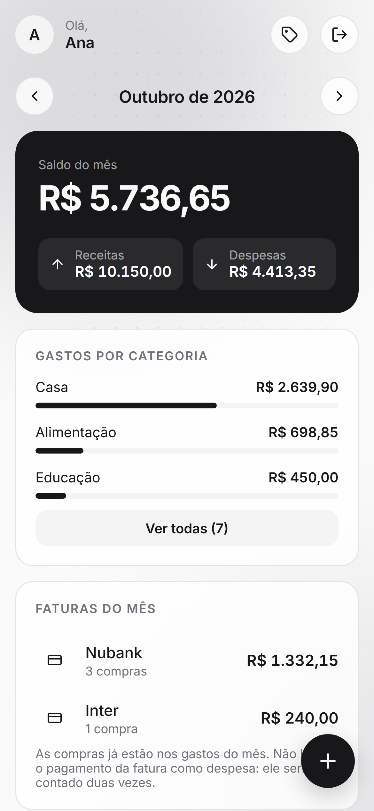
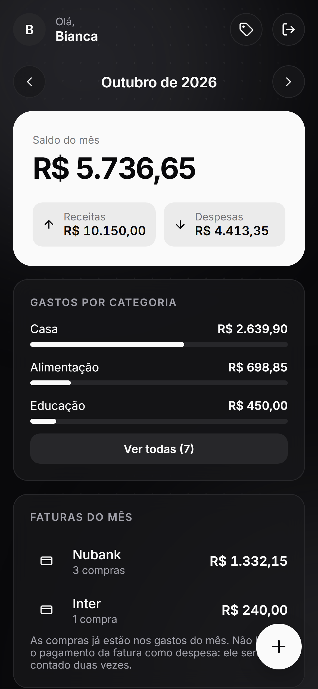

<div align="center">

# Bicavi

**O orçamento do mês da casa, no bolso.**

[](https://github.com/devluiscavalcante/bicavi-finance/actions/workflows/ci.yml)


<sub>Dados fictícios · <a href="docs/images/demo.mp4">versão em MP4</a></sub>

</div>

## Sobre



Todo mês, o casal anotava no papel as contas a pagar, somava os salários e via quanto
sobrava. O Bicavi faz isso pelo celular: cada um lança o que entrou e o que saiu,
e o saldo do mês aparece na hora. Também dá para **planejar os meses seguintes**,
lançando salários e parcelas do cartão com antecedência.

- **Resumo do mês:** saldo, receitas, despesas e gastos por categoria
- **Lançamento rápido:** Pix, dinheiro, débito, crédito ou boleto
- **Cartões e faturas:** tocar numa fatura filtra as compras do cartão
- **Parcelas:** de 2x a 24x, editando só uma ou ela e as seguintes
- **Períodos:** meses futuros livres, o anterior editável até o dia 5 e os antigos somente leitura
- **PWA:** instala no iPhone, tem tema claro e escuro e troca de mês com um deslizar

<br clear="right">

## Stack e arquitetura



- **Backend:** Java 21, Spring Boot 4.1, Spring Security (JWT), JPA, Flyway, Bucket4j
- **Banco:** PostgreSQL 17
- **Frontend:** React 19, TypeScript, Vite, PWA
- **Testes:** JUnit, Mockito, MockMvc, Testcontainers, Vitest
- **Infra:** Docker Compose, nginx, Tailscale, GitHub Actions

`iPhone → HTTPS (Tailscale) → nginx (app + proxy /api) → Spring Boot → PostgreSQL`

O código do backend é organizado **por funcionalidade** (`auth`, `transaction`, `card`, `report`...).

**Decisões que valem destacar:**

- Dinheiro em `BigDecimal` / `NUMERIC(12,2)`, sempre positivo, com o sinal no tipo
- JWT stateless com BCrypt; dado de outro usuário responde 404, com teste de isolamento
- Login limitado a 5 tentativas por e-mail (`429 + Retry-After`)
- Erros no formato `ProblemDetail` (RFC 9457)
- Schema versionado com Flyway; o Hibernate só valida
- CSP restrita no nginx, sem `unsafe-inline`

<br clear="right">

## Rodando localmente

Pré-requisitos: Java 21, Node 24 e Docker.

```bash
cd backend && cp .env.example .env   # preencha DB_PASSWORD e JWT_SECRET (mín. 32 caracteres)
docker compose up -d                 # Postgres de desenvolvimento
./mvnw spring-boot:run               # API em :8080
cd ../frontend && npm install && npm run dev   # app em :5173
```

Testes: `./mvnw test` no backend e `npm test` no frontend. O CI roda os dois a cada push.

O deploy de produção (Docker + Tailscale num PC de casa, com backup diário) está descrito no **[DEPLOY.md](DEPLOY.md)**.
